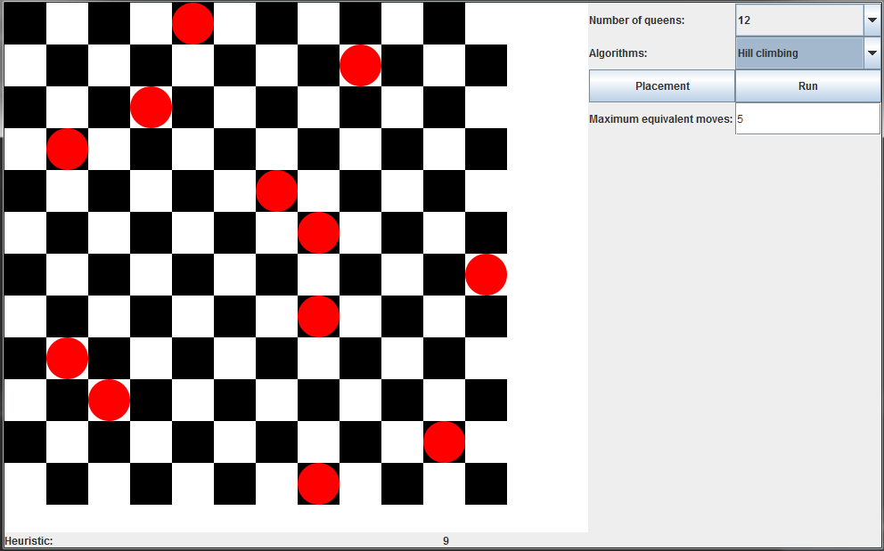

# Lokalni iskalni algoritmi
Resevanje  problema postavitve N dam na šahovnico velikosti N×N uz pomoc algoritmov:hill climbing, simulated annealing, local beam search, genetic algorithm.
Aplikacija omogoca graficki prikaz resevanja posameznega algoritme, ter tudi omogoca uporabniku vnos parametrov za vsak algoritem.

##Izgled aplikacije

